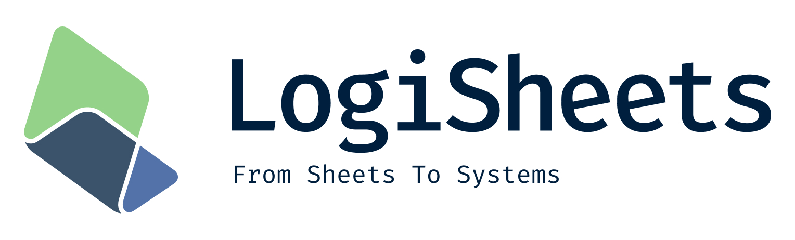

# LogiSheets

## What is LogiSheets?

LogiSheets is a web-based spreadsheet application that seamlessly integrates with Excel and is crafted for expansion. Notably, it comes at no cost!

You can utilize the Rust crate and Node package to efficiently read, perform operations, and write .xlsx files.

We are also working on a user interface to enable users to use spreadsheets directly in their web browsers.

## Packages

| Package | Path | Description | License |
|---------|------|-------------|---------|

| **logisheets-rs** | `crates/api` | Rust API for LogiSheets spreadsheet engine | MIT |
| **logisheets-web** | `packages/web` | Web SDK for browser-based spreadsheet applications | MIT |
| **logisheets-node** | `packages/node` | Node.js bindings for server-side spreadsheet operations | MIT |
| **logisheets-engine** | `packages/engine` | Full-featured spreadsheet UI component | MIT (watermarked, contact us for removal) |

## WARNING

LogiSheets is currently in its **early development** stages. We welcome your feedback, issues, or pull requests!

## Design goals

- **Easy further development**: LogiSheets provides rich APIs to help you develop your plugins.
- **Structural Data Support**: LogiSheets introduces a data structure (temporarily named Block) to maintain the consistent positions of cells within a specified area.
- **Supporting Cowork**
