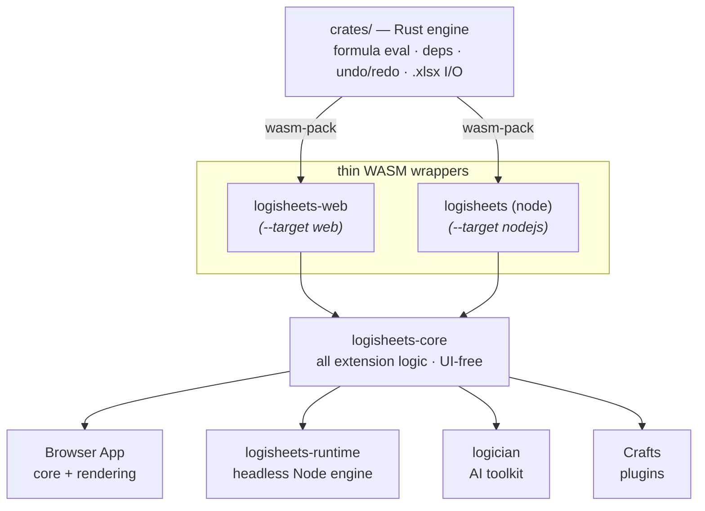

# LogiSheets

**From sheets to systems.** LogiSheets is a web-based spreadsheet built on a Rust engine compiled to WebAssembly — it reads, manipulates, and writes real `.xlsx` files, and runs the same engine in the browser and on Node. But it's more than a grid: with **structured data (Blocks)** that carry schema, types, and validation, and a **plugin system (Crafts)** that turns workbooks into real applications, a LogiSheets spreadsheet stops being a static document and becomes a building block of an actual system.

### ▶ See it in action — [Factory Simulator live demo](https://www.logisheets.com/?craft=factory-simulator)

An interactive simulation game built entirely on LogiSheets — Blocks, live formulas, and clickable cell interactions in the browser. The best one-minute tour of what the engine can do.

📖 **Documentation:** [docs.logisheets.com](https://docs.logisheets.com/)

## Why LogiSheets

- **One engine, everywhere.** The core spreadsheet engine is written in Rust and compiled to WASM. The exact same logic powers the browser app and a headless Node runtime — no reimplementation, no drift.
- **Real Excel files.** Read and write `.xlsx` with formulas, styles, and structure preserved.
- **Structured data (Blocks).** A `Block` keeps a region of cells together as a coherent, schema-aware table — cells are addressed by stable IDs, so inserts and deletes never break references. Fields carry types, validation rules, uniqueness, and required constraints.
- **Built to extend.** A rich API surface plus a plugin system (Crafts) let you add features without forking the core. The logic layer is engine-neutral and reusable from any host.
- **AI-native.** `logician` is an agent toolkit that operates workbooks through structured tools; it powers **Watson**, the in-app AI assistant, and runs equally well on Node.
- **Fast & correct.** Dependency-tracked recalculation and persistent (immutable) data structures give efficient undo/redo without cloning the whole workbook.

## Crafts — the plugin system

Crafts are self-contained mini-apps that extend LogiSheets through the same public API the core uses. They're written in **plain JavaScript/TypeScript**, so the entire rich frontend ecosystem — UI libraries, charts, editors, AI SDKs — can be brought right into the spreadsheet. Shipped examples live under `crafts/`:

- **factory-simulator** — interactive simulation game (zh / en) showcasing Blocks, formulas, and craft interactions. **[▶ Try it live](https://www.logisheets.com/?craft=factory-simulator)**
- **Watson** — the in-app AI assistant (built on `logician`)
- **what-if-calculator** — scenario analysis over workbook values
- **markdown-table-extractor** — turn Markdown tables into Blocks

## Documentation

Guides, API reference, and tutorials live at **[docs.logisheets.com](https://docs.logisheets.com/)** (source in [`docs/`](./docs)).

---

## Architecture

LogiSheets is layered so that logic lives in exactly one place and every host reuses it:

```mermaid
flowchart TD
    engine["crates/ — Rust engine<br/>formula eval · deps · undo/redo · .xlsx I/O"]
    web["logisheets-web<br/><i>(--target web)</i>"]
    node["logisheets (node)<br/><i>(--target nodejs)</i>"]
    core["logisheets-core<br/>all extension logic · UI-free"]
    app["Browser App<br/>core + rendering"]
    runtime["logisheets-runtime<br/>headless Node engine"]
    logician["logician<br/>AI toolkit"]
    crafts["Crafts<br/>plugins"]

    engine -->|wasm-pack| web
    engine -->|wasm-pack| node
    web --> core
    node --> core
    core --> app
    core --> runtime
    core --> logician
    core --> crafts

    subgraph wrappers ["thin WASM wrappers"]
        web
        node
    end
```

The WASM wrappers expose the engine over a simple RPC surface and carry no extension logic. `logisheets-core` holds the portable logic and depends on the engine only for *types* — the concrete `Client` is injected by each host, so the same code runs in the browser and on Node. Rendering stays in the browser layer.

## Packages

| Package | Path | Description |
|---------|------|-------------|
| **logisheets-rs** | `crates/api` | Rust API for the spreadsheet engine |
| **logisheets-web** | `packages/web` | Browser WASM SDK (`/pure` subpath for WASM-free use) |
| **logisheets** (node) | `packages/node` | Node.js WASM bindings |
| **logisheets-core** | `packages/core` | Engine-neutral extension logic, shared by every host |
| **logisheets-runtime** | `packages/runtime` | Headless spreadsheet runtime for Node |
| **logisheets-engine** | `packages/engine` | Canvas-based spreadsheet UI component — watermarked, contact us for removal |
| **logisheets-formula-editor** | `packages/formula-editor` | CodeMirror 6 formula editor |
| **logician** | `packages/logician` | AI agent toolkit for operating workbooks (browser + Node) |

## Contributing

Issues and pull requests are welcome.

## License

MIT — see [LICENSE](./LICENSE).
