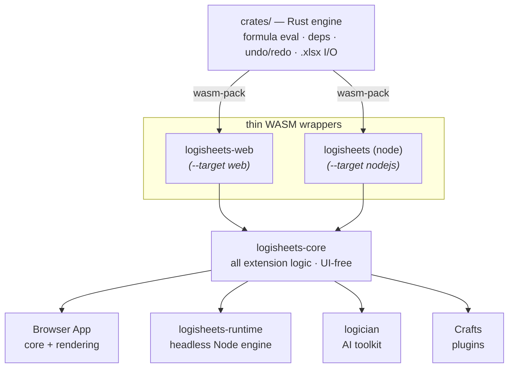

# LogiSheets

**The spreadsheet as common ground for people and AI.** LogiSheets is a web-based spreadsheet built on a Rust engine compiled to WebAssembly — it reads, manipulates, and writes real `.xlsx` files, and runs the same engine in the browser and on Node. What makes it different is who it's built for: **both** the person looking at the grid and the agent operating on it.

A spreadsheet is the most widely understood interface humans have for structured data, and one of the worst interfaces a machine could be handed. Everything that makes a sheet readable to a person is invisible to a model — the extent of a table is a visual convention, the header row is a habit, and what column D *means* lives in somebody's head. So an AI given a spreadsheet guesses at coordinates and writes plausible cells that are wrong in ways nobody notices until much later.

LogiSheets closes that gap in the document itself. **Blocks** give regions a stable identity and a schema, so an agent addresses data as *(block, field, key)* rather than `Sheet1!C5`. Declarations, rules, and write policies live in the file — the engine can tell an agent what a column means, when a value is wrong, and which cells it may not touch. The human still sees an ordinary grid, and the file is still a real `.xlsx`.

→ **[AI and humans, same document](https://docs.logisheets.com/ai)** — what an agent actually sees, and how the boundaries work.

> An **open-source spreadsheet library** and **Excel (`.xlsx`) engine** for **JavaScript / TypeScript** and **Rust** — read, write, and evaluate spreadsheets with **formula** support in the **browser** (via **WebAssembly**), on **Node.js**, or natively in Rust. A programmable alternative to SheetJS / ExcelJS with a full recalculation engine, an embeddable UI, and a first-class agent toolkit.

### ▶ See it in action — [Factory Simulator live demo](https://www.logisheets.com/?craft=factory-simulator)

An interactive simulation game built entirely on LogiSheets — Blocks, live formulas, and clickable cell interactions in the browser. The best one-minute tour of what the engine can do.

📖 **Documentation:** [docs.logisheets.com](https://docs.logisheets.com/)

## Why LogiSheets

- **One engine, everywhere.** The core spreadsheet engine is written in Rust and compiled to WASM. The exact same logic powers the browser app and a headless Node runtime — no reimplementation, no drift.
- **Real Excel files.** Read and write `.xlsx` with formulas, styles, and structure preserved.
- **Structured data (Blocks).** A `Block` keeps a region of cells together as a coherent, schema-aware table — cells are addressed by stable IDs, so inserts and deletes never break references. Fields carry types, validation rules, uniqueness, and required constraints.
- **Legible to an agent.** A block is a *noun* an AI can name, with fields it can read the meaning of and records it can address by key. Whatever an agent declares, it can read back — the state is in the file, not in a prompt.
- **Wrong is visible, not silent.** The engine generates validation from the declaration and reports every cell that currently fails it, so a mistake surfaces as data an agent can act on instead of a number that merely looks fine.
- **Boundaries in both directions.** Write policies distinguish the block's owner, other crafts, and *the user*, so a human can fence an agent out of a column — and a craft can be allowed to seed rows a person would be held to.
- **Built to extend.** A rich API surface plus a plugin system (Crafts) let you add features without forking the core. The logic layer is engine-neutral and reusable from any host.
- **Fast & correct.** Dependency-tracked recalculation and persistent (immutable) data structures give efficient undo/redo without cloning the whole workbook.

## Working with AI

`logisheets-logician` is the agent toolkit: LLM tool definitions that operate a real workbook, plus the prompts and skills that go with them. The same definitions power **Watson**, the in-app assistant, and [`logisheets-mcp`](https://github.com/logisky/logisheets-mcp), which exposes the engine over the Model Context Protocol to any MCP host.

What an agent gets that a raw grid can't give it:

- **Semantic addressing.** *"Set the `revenue` field of the `2024` record in the `income_statement` block"* — not "write `C7`". The address survives every insert, delete and sort, so the agent never has to track where things moved to.
- **A workbook it can read back.** `describe_block` returns the schema an agent declared earlier — field types, rules, computed columns, what analyses exist. Multi-step work keeps its state in the document rather than in a context window.
- **Deterministic arithmetic.** Totals, aggregates and pivots are declared and evaluated by the engine. The agent decides *what* to compute; it never has to be trusted to do the sums.
- **Being told it is wrong.** `list_violations` reports every cell that currently fails its rule, and `why_locked` explains in plain language why a cell can't be written to. Both close the loop that a plain grid leaves open.
- **An artifact a person can keep.** The result is a real `.xlsx` — openable, auditable, and editable by hand long after the agent is gone.

Every tool declares whether it mutates the workbook and carries a confirmation policy, so a host can let reads run freely and keep a person in the loop on writes. Crafts extend the same surface: annotate a function with JSDoc and `craftsmith` turns it into a capability Watson can call, so one implementation serves your UI and the AI at once.

## Crafts — the plugin system

**From sheets to systems.** Crafts are self-contained mini-apps that extend LogiSheets through the same public API the core uses. They're written in **plain JavaScript/TypeScript**, so the entire rich frontend ecosystem — UI libraries, charts, editors, AI SDKs — can be brought right into the spreadsheet. Shipped examples live under `crafts/`:

- **factory-simulator** — interactive simulation game (zh / en) showcasing Blocks, formulas, and craft interactions. **[▶ Try it live](https://www.logisheets.com/?craft=factory-simulator)**
- **what-if-calculator** — scenario analysis over workbook values
- **markdown-table-extractor** — turn Markdown tables into Blocks

Scaffold, check, and build a craft with the **`craftsmith`** CLI (`npx craftsmith new`). A craft can also expose **tools** to **Watson** (the built-in AI assistant) just by annotating its functions — one implementation drives both your UI and the AI. See [Write your own craft](https://docs.logisheets.com/craft/writing-a-craft).

## Documentation

Guides, API reference, and tutorials live at **[docs.logisheets.com](https://docs.logisheets.com/)** (source in [`docs/`](./docs)).

---

## Architecture

LogiSheets is layered so that logic lives in exactly one place and every host reuses it:

```mermaid
flowchart TD
    engine["crates/ — Rust engine<br/>formula eval · deps · undo/redo · .xlsx I/O"]
    web["logisheets-web<br/><i>(--target web)</i>"]
    node["logisheets (node)<br/><i>(--target nodejs)</i>"]
    core["logisheets-core<br/>all extension logic · UI-free"]
    app["Browser App<br/>core + rendering"]
    runtime["logisheets-runtime<br/>headless Node engine"]
    logician["logician<br/>AI toolkit"]
    crafts["Crafts<br/>plugins"]

    engine -->|wasm-pack| web
    engine -->|wasm-pack| node
    web --> core
    node --> core
    core --> app
    core --> runtime
    core --> logician
    core --> crafts

    subgraph wrappers ["thin WASM wrappers"]
        web
        node
    end
```

The WASM wrappers expose the engine over a simple RPC surface and carry no extension logic. `logisheets-core` holds the portable logic and depends on the engine only for *types* — the concrete `Client` is injected by each host, so the same code runs in the browser and on Node. Rendering stays in the browser layer.

## Packages

| Package | Path | Description |
|---------|------|-------------|
| **logisheets-rs** | `crates/api` | Rust API for the spreadsheet engine |
| **logisheets-web** | `packages/web` | Browser WASM SDK (`/pure` subpath for WASM-free use) |
| **logisheets** (node) | `packages/node` | Node.js WASM bindings |
| **logisheets-core** | `packages/core` | Engine-neutral extension logic, shared by every host |
| **logisheets-runtime** | `packages/runtime` | Headless spreadsheet runtime for Node |
| **logisheets-engine** | `packages/engine` | Canvas-based spreadsheet UI component (MIT, fully open source) |
| **logisheets-formula-editor** | `packages/formula-editor` | CodeMirror 6 formula editor |
| **logisheets-logician** | `packages/logician` | AI agent toolkit for operating workbooks — LLM tool definitions used by Watson and by [logisheets-mcp](https://github.com/logisky/logisheets-mcp) |
| **logisheets-craftsmith** | `packages/craftsmith` | CLI to scaffold, check, build & pack crafts (generates the tool manifest Watson reads) |
| **logisheets-desktop** | `packages/desktop` | Desktop app — a [Tauri](https://tauri.app/) shell that runs the web app (WASM engine) in a native window (experimental; see its [README](./packages/desktop/README.md)) |

## Contributing

Issues and pull requests are welcome.

## License

MIT — see [LICENSE](./LICENSE).
